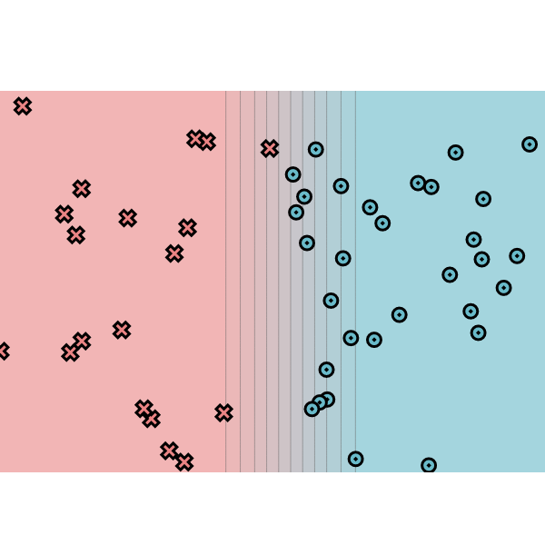

# MiniTorch Module 0

* Docs: https://minitorch.github.io/

* Overview: https://minitorch.github.io/module0.html

## Hand-selected linear classifier

This uses the parameters: $\mathbf{w} = (-10, 0)$, $b = 5$.
